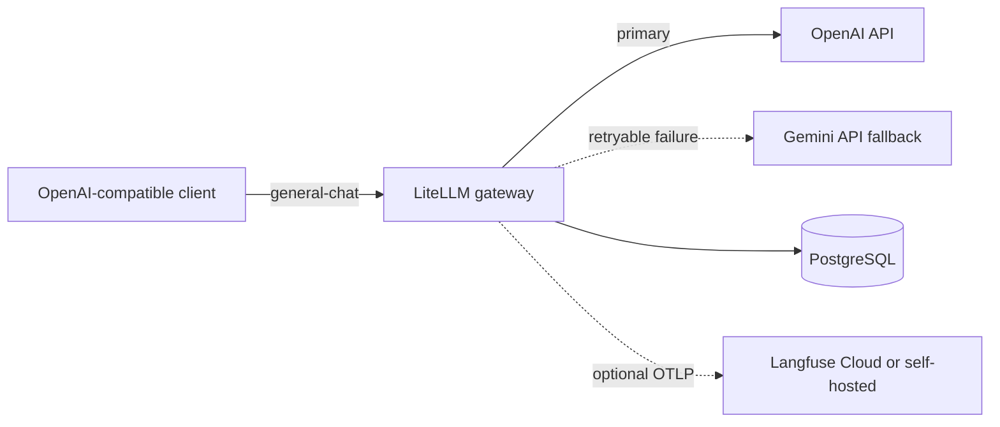

# Resilient LiteLLM Gateway

A production-oriented reference implementation of an OpenAI-compatible LLM gateway with an OpenAI primary route, a Google Gemini API fallback, PostgreSQL persistence, optional Langfuse/OpenTelemetry observability, Docker Compose for local use, and a Cloud Run-compatible container.

It demonstrates provider abstraction and bounded failover without claiming universal high availability.



## What this project demonstrates

- A stable `general-chat` client alias hiding provider-specific model names
- OpenAI as primary and the direct Gemini API as cross-provider fallback
- Error-specific, bounded retries plus cooldown handling
- LiteLLM master/virtual-key management and PostgreSQL-backed usage data
- Secrets supplied only at runtime
- Native Langfuse OpenTelemetry integration with no custom payload-mutating code
- A small local stack and a portable Cloud Run container
- Offline configuration, fallback, syntax, Compose, and secret-safety checks

## Request flow

`general-chat` first calls `PRIMARY_MODEL` through OpenAI. A LiteLLM-classified provider failure can enter the configured fallback chain after at most two retries. `gemini-direct` then calls `FALLBACK_MODEL` through the Gemini API. Authentication, malformed-request, and content-policy errors have zero same-provider retries.

The Gemini deployment explicitly drops three sampling fields deprecated by current Gemini models; no global parameter-dropping switch is enabled.

Provider-qualified models remain runtime settings. The examples currently use `openai/gpt-5.6-luna` and `gemini/gemini-3.7-flash`; review provider availability and pricing before deployment.

See [resilience details](docs/resilience.md) for the precise boundary and limitations.

## Technology stack

- LiteLLM Proxy `1.100.1`
- OpenAI API
- Google Gemini API using `GEMINI_API_KEY` (no Vertex credentials)
- PostgreSQL 16
- Docker / Docker Compose
- Optional Langfuse via LiteLLM's native `langfuse_otel` callback
- GitHub Actions

## Local quick start

```bash
cp .env.example .env
```

Replace every `replace-me` value in `.env`, then:

```bash
docker compose up -d --build
make health
```

The gateway listens on `http://127.0.0.1:4000` by default. PostgreSQL is not published to the host.

Call the provider-agnostic alias:

```bash
curl --fail-with-body http://127.0.0.1:4000/v1/chat/completions \
  -H "Authorization: Bearer $LITELLM_MASTER_KEY" \
  -H "Content-Type: application/json" \
  --data '{"model":"general-chat","messages":[{"role":"user","content":"Reply with exactly: ready"}],"max_tokens":32}'
```

## Configuration

| Variable | Purpose |
| --- | --- |
| `OPENAI_API_KEY` | OpenAI provider credential |
| `GEMINI_API_KEY` | Gemini API credential |
| `PRIMARY_MODEL` | Provider-qualified OpenAI model |
| `FALLBACK_MODEL` | Provider-qualified Gemini model |
| `LITELLM_MASTER_KEY` | Gateway administrator credential |
| `LITELLM_SALT_KEY` | Stable encryption salt for persisted LiteLLM data |
| `DATABASE_URL` | PostgreSQL connection string |

The public aliases are:

- `general-chat`: OpenAI primary with Gemini fallback
- `openai-direct`: direct primary-provider validation
- `gemini-direct`: direct fallback-provider validation

## Validation and testing

Offline checks do not call paid APIs:

```bash
python3 -m venv .venv
.venv/bin/pip install -r requirements-dev.txt
make validate PYTHON=.venv/bin/python
make docker-build
```

The fallback unit test uses LiteLLM Router mock responses and makes no network request. Live tests are intentionally separate:

```bash
RUN_PAID_PROVIDER_TESTS=1 make test-openai
RUN_PAID_PROVIDER_TESTS=1 make test-gemini
RUN_PAID_PROVIDER_TESTS=1 make test-live-fallback
```

The explicit acknowledgement prevents credentials already present in the shell from triggering an accidental provider request. Direct and controlled Router-level checks are documented in [operations.md](docs/operations.md); the disposable end-to-end proxy procedure is documented in [resilience.md](docs/resilience.md). Run either only in a non-production environment.

## Observability

LiteLLM emits JSON logs to stdout/stderr. Its native `langfuse_otel` callback is configured, but Langfuse remains optional: set `LITELLM_OTEL_V2=true` and provide `LANGFUSE_PUBLIC_KEY`, `LANGFUSE_SECRET_KEY`, and `LANGFUSE_HOST` to export traces to Langfuse Cloud or a self-hosted endpoint. OTel v2 defaults to metadata-only traces; keep `OTEL_INSTRUMENTATION_GENAI_CAPTURE_MESSAGE_CONTENT=no_content` unless content capture is explicitly approved.

See [observability.md](docs/observability.md).

## Security

The repository contains placeholders only. Local services bind to loopback, Postgres stays on the private Compose network, custom callbacks have been removed, and CI checks likely secret formats, private IPs, service-account material, and stale corporate identifiers.

See [security.md](docs/security.md).

## Cloud Run deployment

The image binds to `0.0.0.0` and expands Cloud Run's runtime `PORT`. Use a managed PostgreSQL endpoint reachable from the service, store all credentials in Google Secret Manager, and deploy the built image with secret-to-environment mappings. No cloud resources are created by this repository.

See [operations.md](docs/operations.md).

## Cost considerations

The main cost drivers are provider tokens, Cloud Run compute, PostgreSQL, logging, and optional Langfuse storage. Apply virtual-key budgets and rate limits, constrain output tokens, choose cost-appropriate models, and test whether fallback traffic changes quality or cost.

See [cost.md](docs/cost.md).

## Known limitations

- Cross-provider behavior is not identical; prompts, tools, structured outputs, and safety handling require workload-specific tests.
- LiteLLM's generic fallback classification is upstream behavior. The retry policy is explicitly error-specific, but operators must validate which real provider errors enter fallback for the pinned version.
- PostgreSQL is a single local container in Compose, not a highly available database.
- Langfuse is an external integration, not part of the core local stack.
- No paid-provider or deployed Cloud Run result is claimed by the repository's offline tests.
- A repository license has not yet been selected.

## Portfolio evidence

Use the redaction-aware checklist in [portfolio-evidence.md](docs/portfolio-evidence.md). Never publish credentials, database URLs, raw sensitive prompts, internal addresses, or unredacted headers.

## Documentation

- [Architecture](docs/architecture.md)
- [Resilience](docs/resilience.md)
- [Observability](docs/observability.md)
- [Security](docs/security.md)
- [Operations](docs/operations.md)
- [Cost](docs/cost.md)
- [Portfolio evidence](docs/portfolio-evidence.md)

## License

No license has been selected. Add an explicit license before inviting reuse or contributions.
