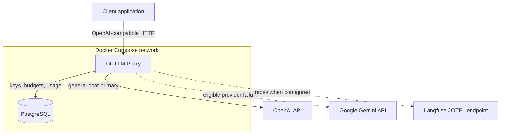
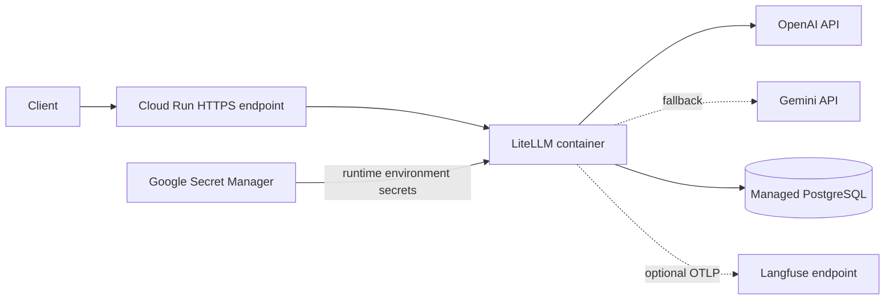

# Architecture

## Local reference architecture

Only LiteLLM is published, and only on host loopback by default. PostgreSQL has no host port mapping. Provider credentials enter the gateway as runtime environment variables.

## Cloud Run pattern

Cloud Run provides ingress and autoscaling, but availability still depends on provider quotas, the database, network paths, regional service health, and configuration correctness. This repository does not provision those resources.

## Component responsibilities

| Component | Responsibility |
| --- | --- |
| Client | Sends OpenAI-compatible requests using `general-chat` |
| LiteLLM | Authenticates, routes, retries, falls back, meters, and logs |
| OpenAI | Primary inference provider |
| Gemini API | Cross-provider fallback and direct validation route |
| PostgreSQL | Virtual keys, teams, budgets, configuration, and usage persistence |
| Langfuse | Optional trace and generation analysis through OTLP |

The model aliases are a contract. Provider model identifiers remain environment-controlled so they can change without forcing client changes.
