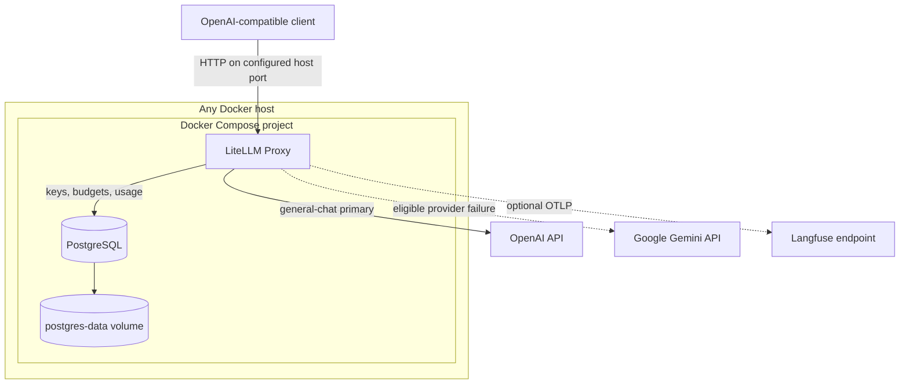

# Architecture

## Portable single-host architecture

`compose.yaml` is the deployment contract. The same stack runs on a developer laptop, workstation, on-premises server, or generic VM. It does not require a cloud-provider control plane or an externally managed database.

Only LiteLLM publishes a host port. It binds to `127.0.0.1` by default; PostgreSQL has no host port mapping. Both services communicate over the private `gateway` Compose network, and PostgreSQL stores durable data in the `postgres-data` named volume.

## Portability boundary

The host must provide:

- Docker Engine and Docker Compose v2;
- enough CPU, memory, and disk for LiteLLM and PostgreSQL;
- outbound HTTPS connectivity to OpenAI, Gemini, and optional Langfuse;
- a backup policy for the PostgreSQL volume;
- a TLS reverse proxy and firewall rules when the gateway is exposed beyond loopback.

The repository deliberately does not include GCP, AWS, Azure, Kubernetes, Terraform, or provider-specific networking. Operators can add infrastructure around the Compose stack without changing its application topology.

## Component responsibilities

| Component | Responsibility |
| --- | --- |
| Client | Sends OpenAI-compatible requests using `general-chat` |
| LiteLLM | Authenticates, routes, retries, falls back, meters, and logs |
| OpenAI | Primary inference provider |
| Gemini API | Cross-provider fallback and direct validation route |
| PostgreSQL | Virtual keys, teams, budgets, configuration, and usage persistence |
| `postgres-data` | Durable single-host database storage |
| Langfuse | Optional trace and generation analysis through OTLP |

The public model aliases are stable client contracts. Provider model identifiers remain environment-controlled so operators can change models without changing client configuration.

## Availability boundary

Compose restart policies recover ordinary process failures, but the host and the local PostgreSQL instance remain single points of failure. This reference demonstrates portable deployment and provider fallback; it does not claim multi-host high availability or automatic database failover.
