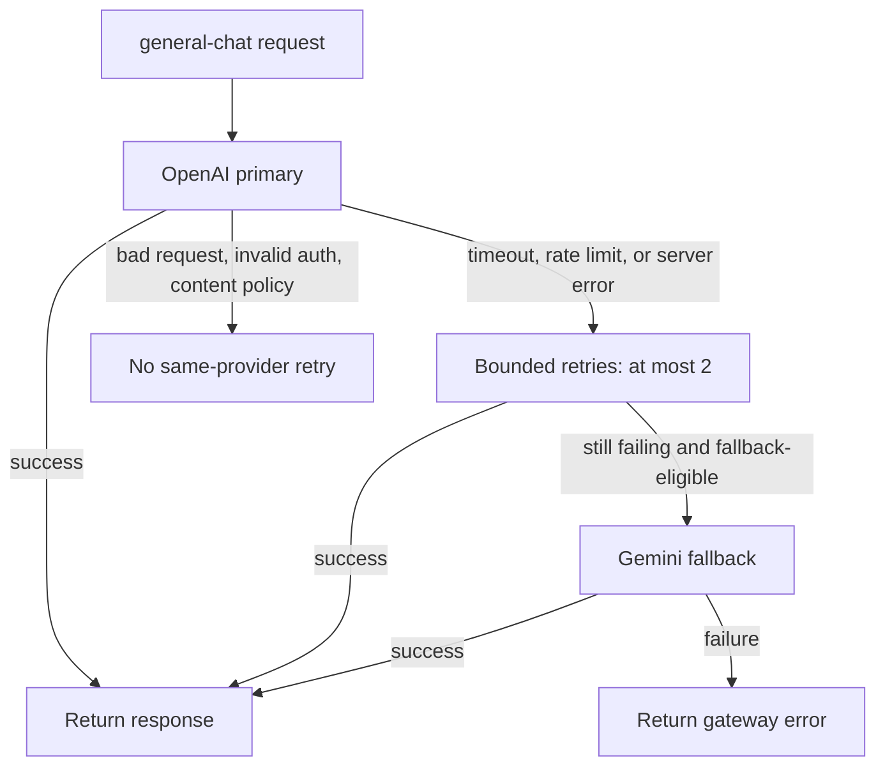

# Resilience

## Policy

OpenAI is the primary route because the project is designed around an OpenAI-compatible client contract. Gemini provides provider diversity through a separate API and credential boundary. This is a reference failover pattern, not a guarantee that every request behaves identically across providers.



`router_settings` provides:

- a 30-second provider timeout;
- two maximum retries, with a one-second minimum retry interval;
- zero retries for authentication, bad-request, and content-policy errors;
- two retries for timeout, rate-limit, and internal-server errors;
- cooldown after repeated failures, with a 60-second cooldown window;
- `general-chat -> gemini-direct` as the only fallback chain.
- explicit removal of deprecated Gemini sampling fields (`temperature`, `top_p`, and `top_k`) only on the fallback deployment.

Retries can increase latency and provider cost. A request that reaches fallback may have made multiple primary attempts. Clients should also bound their own retries to avoid multiplicative retry storms.

## Offline fallback proof

Run:

```bash
make test-fallback PYTHON=.venv/bin/python
```

The test instantiates LiteLLM Router, forces its documented mock fallback path, returns a mock Gemini response, and asserts the fallback result. It uses placeholder keys and performs no network or paid inference.

## Controlled proxy fallback proof

For a smaller live Router-level proof, run the opt-in helper first:

```bash
RUN_PAID_PROVIDER_TESTS=1 make test-live-fallback
```

It sends the primary deployment to a loopback HTTP 500 stub, then makes one real
Gemini request through the documented fallback chain. It does not call OpenAI.
This proves Router fallback behavior but not the running proxy path.

LiteLLM no longer honors proxy request mock flags in recent versions. For an end-to-end gateway demonstration, use a disposable non-production configuration:

1. Copy `config.yaml` outside the tracked repository.
2. Change only the copied `general-chat` deployment to a local stub that returns HTTP 429 or 503.
3. Keep `gemini-direct` configured with a valid test key.
4. Start a disposable gateway against the copied configuration.
5. Send a normal `general-chat` request.
6. Capture the requested alias, `x-litellm-model-id`, response model, and sanitized JSON logs.
7. Delete the disposable configuration.

Do not invalidate real credentials. Do not claim a successful live fallback until the response and logs show that Gemini served it.

## Limitations

- LiteLLM owns the final exception classification and fallback decision. Revalidate behavior on every version upgrade.
- A content-policy rejection is deliberately not given a separate content-policy fallback.
- Provider capability differences can turn an otherwise valid cross-provider request into a bad request.
- Streaming failures after bytes have reached a client may not be safely replayable.
- Cooldown state is process-local unless a supported shared state backend is configured; this small reference does not add Redis.
